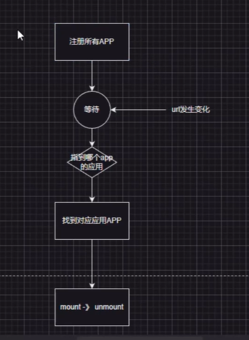

# 微服务、微前端

1.技术栈的无关性：主应用不关心子应用的技术栈，子应用有完全的技术栈自主性

2.独立开发，独立部署：子框架维护了自动更新功能

3.增量升级更新的操作：增量优雅升级，存量的业务保持不变 对于新增的业务是渐进式
的扩展
4.运行环境：独立

5.环境隔离：css隔离js隔离

6.消息通知：统一的通知方式

7.依赖复用：common dependency 不会重复引用

## single-spa
当前为前端的基础框架

生命周期 url发生变化

如何去做样式隔离？ postcss 、shadow-dom
如何实现js隔离？systemjs import、主应用入口处直接引用js ，基于iframe进行隔离

## iframe
iframe 完全独立的子页面
子页面嵌入到父系统

1.主应用： www.baidu.com/sub_a/sub_path url无法保证同步
2.UI问题
3.内存变量不共享 cookie webstorage
4.打开一个页面 全部资源重新加载

通过postmessage方式解决
不是特别友好

## qiankun
基于proxy进行隔离

