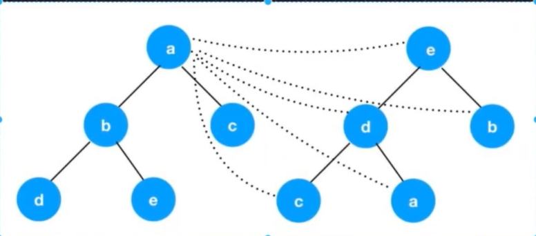
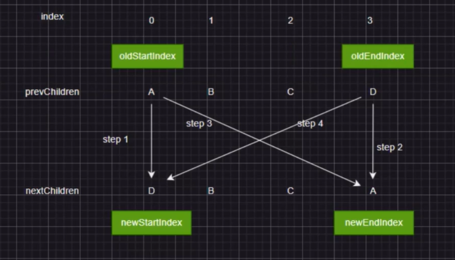

## vue2
### 前置知识

目标：掌握Vue2核心源码的执行流程，掌握Vue2 diff的使用

使用什么框架进行开发？

使用什么方式进行类型校验呢？

dev 的核心是scripts/config中标识出来

flow（了解即可， ）的作用类似于ts，因为编写vue2时，flow更加完善，适合es6的编写，使用时在文件上增加@flow注释.

1.类型推断：在开发的时候，编译过程中就能找到类型的问题

```js
/* @flow */
function split(str){
    return str.split('.');
}

split(1);
```

2.类型注释： 
```js
/* @flow */
function add(x:number,y:number){
    return x+y
}

add('123',456);// 会报错，因为类型不符合
```


vue2 强调es6 eslint flow


### Vue2的核心源码模块

首先看package.json、scripts向外发散，看目录结构（核心点在src中） 

src中文件：1.compiler编译的核心内容，2.core核心代码，3.platforms宿主环境：代码在哪跑。4.server服务端渲染的内容。5.sfc单文件组件。6.shared对应的通用的方法

build过程scipts/build.js


#### 两个点
runtime only：运行时，将.vue 通过vue-loader解析编译成js文件

runtime + compiler没有对代码进行处理

```js
// 需要编译器的版本
new Vue({
    template: '<div>{{hi}}</div>'
})

new Vue({
    reder(h){
        return h('div',this.hi)
    }
})
// 模板语言需要编译器转化成方法，这就是编译的过程


import vue from 'Vue';

new vue();// 这么使用   _init()核心配置项
```

initGlobalApi 初始化全局api的方法

整个流程：new Vue过程中 -> 进入到initMixin -> 开始$mount的过程 -> 进行compole编译 -> 执行reder -> 本质就是vnode ->update(本质patch)  -> 渲染DOM


### vue2中的diff算法


判断哪些节点需要更新，哪些节点不需要更新

1. 只比较同层的节点。
2. 同层比较时，如果类型不同，会把该节点和该节点的所有子节点全部销毁。
3. 类型相同时，key

```js
mount(vnode) -> vnode -> DOM
patch diff 更新
```

vue2的diff算法 双端比较  （同级比较）

A B C D E F G

B C D E F G A

步骤：
1. 判断是不是首次渲染，如果是首次执行createElement，如果不是首次渲染，如果类型不同，会把该节点和该节点的所有子节点全部销毁。


```js
// 核心参数oldVnode，vnode
function patch(oldVnode, vnode, hydrating, removeOnly) {
    // 判断新的vnode是否为空
    // 老的节点在，新的节点不在
    if (isUndef(vnode)) {
        // 卸载所有老的vnode
        if (isDef(oldVnode)) invokeDestroyHook(oldVnode)
        return
    }

    let isInitialPatch = false
    const insertedVnodeQueue: any[] = []

    // 老的节点不存在，直接创建新节点
    if (isUndef(oldVnode)) {
        isInitialPatch = true
        createElm(vnode, insertedVnodeQueue)
    } else {
        const isRealElement = isDef(oldVnode.nodeType)
        // 老节点不是真实的DOM 节点，并且新老节点的type和key相同，进行patchVnode更新工作
        if (!isRealElement && sameVnode(oldVnode, vnode)) {
            // 关键
            patchVnode(oldVnode, vnode, insertedVnodeQueue, null, null, removeOnly)
        } else {
            // 如果不是同一元素节点
            // 当老节点是真实Dom节点
            // if (isRealElement) {
            //     if (oldVnode.nodeType === 1 && oldVnode.hasAttribute(SSR_ATTR)) {
            //     oldVnode.removeAttribute(SSR_ATTR)
            //     hydrating = true
            //     }
            //     if (isTrue(hydrating)) {
            //     if (hydrate(oldVnode, vnode, insertedVnodeQueue)) {
            //         invokeInsertHook(vnode, insertedVnodeQueue, true)
            //         return oldVnode
            //     } else if (__DEV__) {
            //         warn(
            //         'The client-side rendered virtual DOM tree is not matching ' +
            //             'server-rendered content. This is likely caused by incorrect ' +
            //             'HTML markup, for example nesting block-level elements inside ' +
            //             '<p>, or missing <tbody>. Bailing hydration and performing ' +
            //             'full client-side render.'
            //         )
            //     }
            //     }
            //     oldVnode = emptyNodeAt(oldVnode)
            // }

        const oldElm = oldVnode.elm
        const parentElm = nodeOps.parentNode(oldElm)

        // 创建新的DOM节点
        createElm(
            vnode,
            insertedVnodeQueue,
            // extremely rare edge case: do not insert if old element is in a
            // leaving transition. Only happens when combining transition +
            // keep-alive + HOCs. (#4590)
            oldElm._leaveCb ? null : parentElm,
            nodeOps.nextSibling(oldElm)
        )

        // update parent placeholder node element, recursively
        if (isDef(vnode.parent)) {
            let ancestor = vnode.parent
            const patchable = isPatchable(vnode)
            while (ancestor) {
            for (let i = 0; i < cbs.destroy.length; ++i) {
                cbs.destroy[i](ancestor)
            }
            ancestor.elm = vnode.elm
            if (patchable) {
                for (let i = 0; i < cbs.create.length; ++i) {
                cbs.create[i](emptyNode, ancestor)
                }
                // #6513
                // invoke insert hooks that may have been merged by create hooks.
                // e.g. for directives that uses the "inserted" hook.
                const insert = ancestor.data.hook.insert
                if (insert.merged) {
                // start at index 1 to avoid re-invoking component mounted hook
                // clone insert hooks to avoid being mutated during iteration.
                // e.g. for customed directives under transition group.
                const cloned = insert.fns.slice(1)
                for (let i = 0; i < cloned.length; i++) {
                    cloned[i]()
                }
                }
            } else {
                registerRef(ancestor)
            }
            ancestor = ancestor.parent
            }
        }

        // destroy old node
        if (isDef(parentElm)) {
            removeVnodes([oldVnode], 0, 0)
        } else if (isDef(oldVnode.tag)) {
            invokeDestroyHook(oldVnode)
        }
        }
    }

    invokeInsertHook(vnode, insertedVnodeQueue, isInitialPatch)
        return vnode.elm
}
```

#### patchVnode

1. vnode oldVnode 指向同一个对象 return
2. oldVnode DOM -> 关联到真实的elm， update class style props events 
3. oldVnode Vnode <span>123</span> <span>456</span> vnode.text 更新内容
4. oldVnode 有子节点 Vnode 没有子节点 delete
5. oldVnode 没有子节点 Vnode 有子节点 add -> creatEle -> 挂在到DOM上
6. oldVnode Vnode都有子节点 updateChildren


#### updateChildren

```js
function vue2Diff(prevChildren , nextChildren ,parent){
    let oldStartIndex = 0,
        oldEndIndex = prevChildren.length - 1,
        newStartIndex = 0,
        newEndIndex = nextChildren.length - 1

    let oldStartNode = prevChildren[oldStartIndex],
        oldEndNode = prevChildren[oldEndIndex],
        newStartNode = nextChildren[newStartIndex],
        newEndNode = nextChildren[newEndIndex]

    while(oldStartIndex<=oldEndIndex&&newStartIndex<=newEndIndex){
        if(oldStartNode.key === newStartNode.key){
            // 用来更新的
            patch(oldStartNode,newStartNode,parent)
            oldStartIndex++
            newStartIndex++
            oldStartNode = prevChildren[oldStartIndex]
            newStartNode = nextChildren[newStartIndex]
        }else if(oldEndNode.key === newEndNode.key){
            patch(oldEndNode,newEndNode,parent)
            oldEndIndex--
            newEndIndex--
            oldEndNode = prevChildren[oldEndIndex]
            newEndNode = nextChildren[newEndIndex]
        }else if(oldStartNode.key === newEndNode.key){
            patch(oldStartNode,newEndNode,parent)

            parent.insertBefore(oldStartNode.elm,oldEndNode.elm.nextSibling);
            oldStartIndex++
            newEndIndex--
            oldStartNode = prevChildren[oldStartIndex]
            newEndNode = nextChildren[newEndIndex]
        }else if(oldEndNode.key === newStartNode.key){
            patch(oldEndNode,newStartNode,parent)
            oldEndIndex--
            newStartIndex++
            oldEndNode = prevChildren[oldEndIndex]
            newStartNode = nextChildren[newStartIndex]
        } else{
            // 四次比较都没比较到
            // 在prevChildren中找newStartNode的key
            let newKey = newStartNode.key
            oldIndex  = prevChildren.findIndex(child => child.key === newKey)

            if(oldIndex > -1){
                let oldNode = prevChildren[oldIndex]
                patch(oldNode,newStartNode,parent)
                parent.insertBefore(oldNode.elm,oldStartNode.elm)
                prevChildren[oldIndex] = undefined // 当前序号为oldIndex中是空
            }else{
                mount(newStartNode,parent,oldStartNode.elm)
            }
            newStartNode = nextChildren[++newStartIndex]
        }
    }

    if(oldEndIndex < oldStartIndex){
        for(let i = newStartIndex;i<=newEndIndex;i++){
            mount(nextChildren[i]);
        }
    }else if(newEndIndex< newStartIndex){
        for(let i = oldStartIndex; i< oldEndIndex,i++){
            parent.removeChild(prevChildren[i]);
        }
    }

}


```

1. 什么时候DOM需要移动
2. DOM节点是如何移动的

全部遍历 -> 全量diff，比较消耗内存